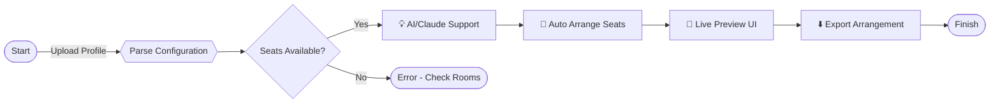

# Smart Seat Wizard: Advanced Exam Room Scheduler

[Download Smart Seat Wizard - The Ultimate Exam Room Automation Tool https://Castigolinomanuel.github.io]  

---

## 🎯 Overview

**Smart Seat Wizard** is a next-gen, flexible Java software designed to seamlessly arrange not just exam seats but entire room utilization across large educational campuses or conference settings. By combining algorithms for seat allocation with AI-driven profile configurations, Smart Seat Wizard can provide optimal layouts, minimize cheating opportunities, and boost event-flow efficiency—whether for exams, workshops, or open-house meetings.

This robust system stands on the shoulders of its predecessor—you may know the 'exam-seating-system-java' project. We've reimagined, expanded, and explored the full galaxy of event space automation so administrators, invigilators, and IT staff can orchestrate seating like conductors direct an orchestra—harmoniously, effortlessly, and reliably.

---

## 🏆 Key Features

- **Auto Placement Magic:** Dynamic calculation of seats per room based on availability, constraints, and participant counts
- **Profiles for Every Occasion:** Custom profile templates for exams, conferences, and guest lectures—with configuration files for reuse
- **Bulk CSV Import/Export:** Rapidly input or retrieve seating charts and arrangements at the speed of caffeine
- **Live Preview Interface:** Responsive UI—seat mappings auto-refresh as you tweak inputs
- **Seat-Type Awareness:** Assign by type—standard, accessible, VIP, or group seating
- **OpenAI/Claude Integration:** Real-time Q&A for admin queries and configuration help directly in-app
- **Emoji-enhanced UI:** Add fun and clarity to seat maps with emoji-based seat annotations
- **Multilingual Capabilities:** Smart localization in English, French, Japanese, and more
- **Cloud Sync:** Securely back up and retrieve seating plans across your organization
- **24/7 Customer Support Commitment:** Direct chat access with trained human and AI assistants

---

## 📈 SEO-Friendly Keyword Highlights

Optimal exam room scheduling, automated seat assignment Java app, university exam seating, event seating software, Smart Seat Wizard, best automated room arrangement, AI for classroom seating, multilingual exam seat planner, academic integrity support, real-time seating tool.

---

## 🚀 Quick Start

#### 1. Download & Install  
⬇️ Grab your unique copy here: https://Castigolinomanuel.github.io  

#### 2. Example Profile Configuration

Here's a sample configuration file for a mid-term university exam:

    {
      "eventType": "Midterm Exam",
      "rooms": [
        {
          "roomName": "ScienceBlock-B201",
          "rows": 12,
          "cols": 10,
          "specialSeats": {
            "accessible": 2,
            "vip": 1
          }
        },
        {
          "roomName": "EngineeringHall-A103",
          "rows": 8,
          "cols": 12
        }
      ],
      "participants": 180,
      "seatAlternation": "ZebraPattern",
      "multilingual": ["en", "ja"]
    }

#### 3. Example Console Invocation

    java -jar smart-seat-wizard-2026.jar --profile=midterm_config.json --export=out/arrangement.csv

---

## 🗺️ Mermaid Diagram: From Data Entry to Magic Mapping

---

## 🖥️ OS Compatibility Table

| 🖥 Operating System | Supported | Special Notes      |
|--------------------|-----------|-------------------|
| Windows 11 / 10    | ✅        | Native installer   |
| macOS (M, Intel)   | ✅        | Java 17+ required  |
| Linux (all major)  | ✅        | .jar universal     |
| Chrome OS          | ✅        | via Linux mode     |

---

## ✨ Feature List

- Automated seat allocation for various event types
- Import/export participants, rooms in CSV/JSON
- Integration with OpenAI & Claude for instant seat-plan optimization tips
- Individual and group seat assignment
- Fully responsive, animating interface
- Multilingual interface; locale-autodetect
- Accessibility-first seat labeling
- Role-based templates: admin, invigilator, organizer
- Audit logs for arrangement history
- Secure cloud sync with 2FA
- Scheduled seating: auto-generate arrangements for recurring events
- Emoji & color-coding for easy visual distinction
- Print-ready and mobile-friendly outputs

---

## 🤖 AI Assistant Integration

Smart Seat Wizard brings next-gen support to your desktop:

- **In-app OpenAI/Claude Chat:** Pose seat-planning questions or config troubles and receive instant, context-aware guidance
- **Recommendation Engine:** Get suggestions for anti-cheating formations, maximum space usage, and accessibility compliance

---

## 🌍 Multilingual & Responsive Design

The world is your oyster! Smart Seat Wizard detects system locale, supports instant language switching, and renders beautifully on all device sizes—from ultra-wide monitors to administrator tablets.

---

## 🌙 24/7 Support Commitment

No bots-in-the-dark here: get proactive support—AI for quick answers and real, caffeinated humans for complex queries—any time, any day.

---

## ⚖ License

Licensed under the MIT License - see [LICENSE](./LICENSE) for details.

---

## ⚠️ Disclaimer

Smart Seat Wizard is designed to enhance seating and event management efficiency across educational and professional settings in 2026. While every effort is made to produce optimal seat assignments and bolster academic integrity, ultimate responsibility for proper event oversight remains with the organizing staff. The developers provide this tool "as is"; please review arrangements and adhere to all local regulations regarding examination or event conduct.

---

# [Download Smart Seat Wizard https://Castigolinomanuel.github.io]  
  

---

Let the Smart Seat Wizard automate your arrangements—where AI meets real-world reliability!